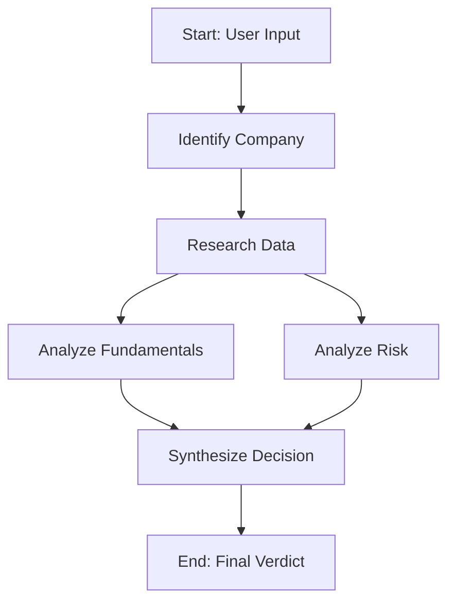

# InvestAgent 📈

A full-stack AI-powered investment research agent. Give it a company name, and it runs a multi-agent pipeline to pull real-time financial data, analyze market sentiment, and deliver a structured investment verdict (**Invest / Pass / Hold**).


## ✨ Features

- **Entity Resolution**: Automatically disambiguates casual inputs (e.g., "Apple" -> Apple Inc., AAPL, Technology).
- **Live Data Ingestion**: Uses Tavily Search API to scrape real-time financial metrics, news, and market sentiment.
- **Dual-Analysis Pipeline**: Separates fundamental analysis (revenue, valuation) from risk analysis (sentiment, red flags) for more objective reasoning.
- **Streaming UI**: Real-time progress tracking on the frontend via Server-Sent Events (SSE).
- **Smart Caching**: MongoDB-backed 24-hour cache layer to minimize LLM and API costs.

## 🏗️ Architecture

The backend utilizes `LangGraph.js` to orchestrate a deterministic, stateful workflow:



*Note: In the current iteration, Fundamentals and Risk are processed sequentially for simplicity, but the architecture supports future parallel execution.*

## 🧠 Design Decisions & Trade-offs

Building an AI agent requires balancing latency, cost, and accuracy. Here is a look under the hood at the architectural choices made for InvestAgent:

### 1. Live Retrieval vs. Vector DB (RAG)
**Decision**: Pass live search results directly into the LLM context window instead of building a Vector DB.
**Why**: In finance, yesterday's news can be completely irrelevant today. Staleness is a dealbreaker. By using Tavily Search to fetch the most recent news and financial summaries on the fly, the agent reasons with up-to-the-minute data. The trade-off is higher token usage per request, but it guarantees high-fidelity analysis.

### 2. LangGraph vs. Standard Promises
**Decision**: Use LangGraph.js for pipeline orchestration rather than a simple chain of async functions.
**Why**: LangGraph forces a structured state definition (via the `ResearchState` channel). This provides:
- **Error Isolation**: If the financial data fetch fails, the pipeline doesn't crash. The state just holds empty data, and the LLM gracefully degrades to outputting "insufficient data".
- **Extensibility**: It makes it trivial to add conditional edges later (e.g., routing private companies to a different analysis flow than public ones).

### 3. Server-Sent Events (SSE) vs. WebSockets
**Decision**: Use SSE for real-time frontend updates.
**Why**: WebSockets are great for bidirectional communication, but for this pipeline, the data flow is strictly one-way (Server -> Client). SSE is much simpler to implement, works natively over standard HTTP, and avoids the overhead of managing WebSocket connections and ping/pong heartbeats.

### 4. Aggressive Caching
**Decision**: Implement a 24-hour TTL (Time-To-Live) cache in MongoDB.
**Why**: LLM calls and Search API hits are expensive. By caching the exact final output of the pipeline based on the normalized company name, duplicate requests within the same day return instantly. This massively reduces API costs during testing or spikes in traffic.

## 🚀 How-To: Getting Started

Follow these steps to get the project running locally on your machine.

### Prerequisites
- Node.js (v18 or higher)
- A MongoDB database (either a local instance or a free [MongoDB Atlas](https://www.mongodb.com/atlas/database) cluster)
- **OpenAI API Key**: Get one from the [OpenAI Platform](https://platform.openai.com/).
- **Tavily API Key**: Get a free tier key from [Tavily](https://tavily.com/).

### 1. Installation

Clone the repository and install dependencies for both the server and client:

```bash
git clone https://github.com/yourusername/invest-agent.git
cd invest-agent

# Install backend dependencies
cd server
npm install

# Install frontend dependencies
cd ../client
npm install
```

### 2. Environment Configuration

Navigate to the `server` directory and create your `.env` file:

```bash
cd server
cp .env.example .env
```

Open the `.env` file in your editor and fill in the values:
```env
OPENAI_API_KEY=sk-proj-your-key-here
TAVILY_API_KEY=tvly-your-key-here
MONGODB_URI=mongodb+srv://your-cluster-url
PORT=5000
```
*(Note: If you don't provide a `MONGODB_URI`, the server will still run perfectly fine, it will just disable the caching layer.)*

### 3. Running the Application

You will need to run the frontend and backend concurrently. Open two terminal windows.

**Terminal 1 (Backend):**
```bash
cd server
npm run dev
# You should see: "Connected to MongoDB" and "Server running on http://localhost:5000"
```

**Terminal 2 (Frontend):**
```bash
cd client
npm run dev
# You should see the Vite server start on http://localhost:5173
```

Open your browser and navigate to `http://localhost:5173`. Type in a company name like "Apple" or "Stripe" and hit Analyze!

### Troubleshooting
- **Analysis fails immediately**: Check your backend terminal. Ensure your OpenAI and Tavily API keys are correct and you have available credits.
- **No data returned**: Tavily can sometimes time out or return empty results for obscure companies. Try a more well-known company like "Tesla" to verify the pipeline works.

## 🗺️ Roadmap

- [ ] **Parallel Execution**: Update the graph to run the `analyzeFundamentals` and `analyzeRisk` nodes concurrently to halve latency.
- [ ] **Structured Financials**: Integrate a dedicated financial API (like Alpha Vantage or Polygon) for hard numbers, rather than relying solely on Tavily search summaries.

## 📝 License

MIT License - feel free to use this for your own projects!
